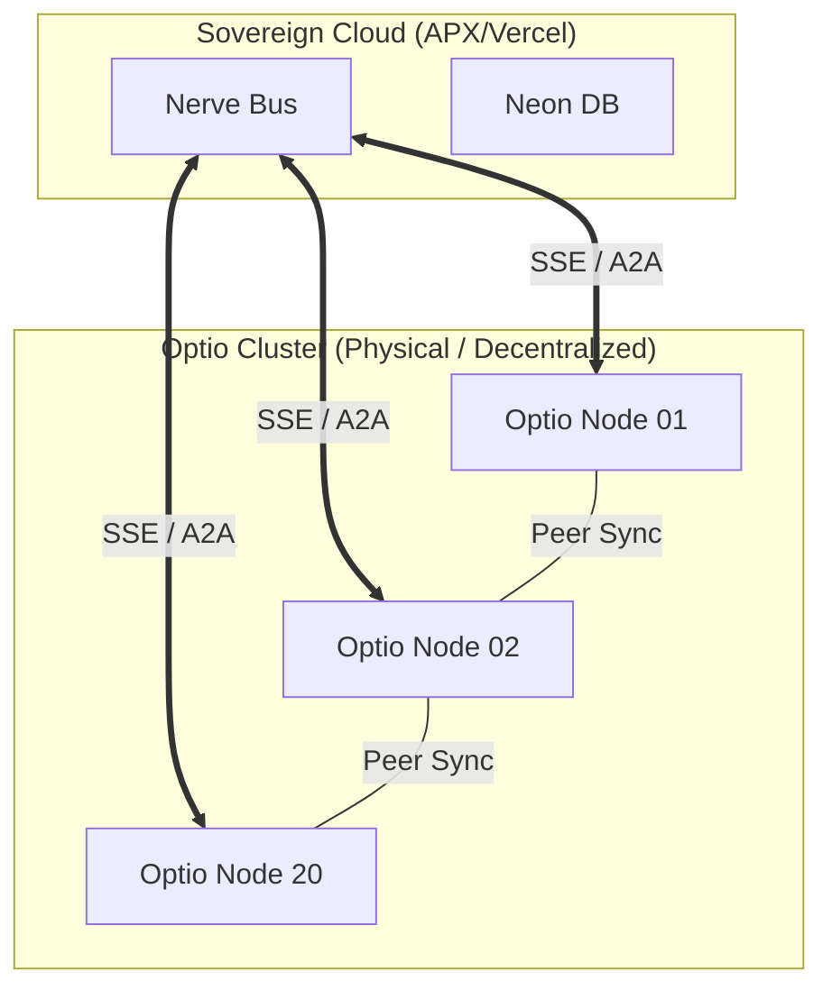

# Blueprint: Distributed Sovereignty (20 Optio Nodes)

## 1. VISION

Integrating 20 decentralized compute nodes into the DreamNet Nerve Bus to achieve local sentient processing and redundant swarm logic.

## 2. TOPOLOGY

## 3. NODE ROLES

- **Nodes 01-05 (The Thinkers)**: Local Inference for high-latency complex reasoning.
- **Nodes 06-10 (The Watchers)**: Real-time Moltbook/EVM monitoring.
- **Nodes 11-15 (The Farmers)**: Asset management and yield optimization.
- **Nodes 16-20 (The Guardians)**: Security audits and Boris-signed verification loops.

## 4. INTEGRATION STEPS

1. **Handshake**: Deploy `OptioBridge.js` to handle API key orchestration for the 20 nodes.
2. **Discovery**: Nodes register themselves to the `AgentRegistry` on the Nerve Bus.
3. **Task Sharding**: Use `ShardDistributor` logic to prioritize local compute over cloud API calls.

## 5. SWARM RECOMMENDATION

- **New Agent**: `OptioOrchestrator` - A specialized agent to manage the load balancing across the 20-node cluster.
- **System**: `Sentinel-20` - A multi-node heartbeat monitor that ensures 24/7 sovereign uptime.
