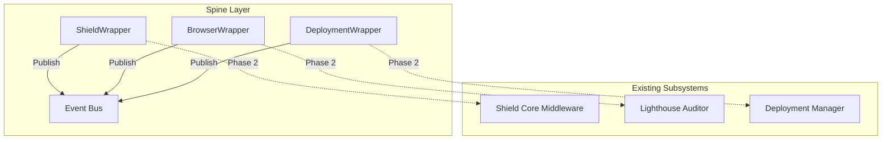

# Registry-Spine Topology Map

**Date:** 2025-11-27
**Mission:** Registry Cartographer

## Executive Summary

✅ **Spine Phase I Complete**
The Interop Spine is active at `/spine/` with the following components:
- **Event Bus:** Active (`dreamnet-event-bus`)
- **Wrappers:** Integrated (`ShieldCore`, `BrowserAgent`, `DeploymentCore`)
- **Scaffolding:** Ready for Phase II (RouteTable, Registry)

✅ **New Integration Packages**
19 new `dreamnet-*` packages have been added to support the ecosystem (see [SPINE_OVERVIEW.md](file:///c:/Users/brand/OneDrive/Documents/GitHub/dream-net/docs/SPINE_OVERVIEW.md)).

## 1. Agent Registry Topology

### 1.1 SuperSpine (Monolith Registry)
**Location:** `server/core/SuperSpine.ts`
**Role:** Real-time agent orchestration
**Status:** Active, not connected to Spine.

### 1.2 Agent Registry Core (Microservices)
**Location:** `packages/agent-registry-core`
**Role:** Configuration-based registry
**Status:** Active, not connected to Spine.

### 1.3 GPT Agent Registry
**Location:** `server/gpt-agents/GPTAgentRegistry.ts`
**Status:** ❌ **MISSING / NOT FOUND** (File does not exist in `server/`)

## 2. Subsystem Entry Points

### 🛡️ Shield Core
**Entry Point:** `packages/dreamnet-control-core/controlCoreMiddleware.ts`
**Function:** `controlCoreMiddleware`
**Current Flow:** HTTP Request → `controlCoreMiddleware` → Route Handler
**Planned Spine Attachment:** `ShieldCoreWrapper` (Stub exists)

### 🌐 Browser Agent
**Entry Point:** `server/lighthouse-auditor.ts`
**Function:** `lighthouseAuditor.auditWebsite(url)`
**Current Flow:** Route Handler → `lighthouseAuditor`
**Planned Spine Attachment:** `BrowserAgentWrapper` (Stub exists)

### 🚀 Deployment Core
**Entry Point:** `packages/deployment-core/src/index.ts`
**Function:** `getDeploymentManager()`
**Current Flow:** Direct calls to manager
**Planned Spine Attachment:** `DeploymentWrapper` (Stub exists)

### 🏥 DreamKeeper
**Entry Point:** `server/core/agents/dreamkeeper.ts`
**Function:** `DreamKeeperAgent.run()`
**Current Flow:** Scheduled task
**Planned Spine Attachment:** `DreamKeeperWrapper` (Stub exists)

## 3. Spine Topology (`/spine/`)

| Component | Location | Status |
|-----------|----------|--------|
| **Event Bus** | `/spine/dreamnet-event-bus` | Scaffolded |
| **Agent Interop** | `/spine/agent-interop` | Scaffolded |
| **BGP Routing** | `/spine/bgp-for-agents` | Scaffolded |
| **Wrappers** | `/spine/wrappers` | Scaffolded (Stubs) |

### Existing Wrappers (Stubs)
- `ShieldCoreWrapper.ts`
- `BrowserAgentWrapper.ts`
- `DeploymentWrapper.ts`
- `DreamKeeperWrapper.ts`
- `FreeTierWrapper.ts`
- `MiniAppWrapper.ts`

## 4. Integration Map

## 5. Recommendations

1.  **Phase 2 Focus:** Connect the stubbed wrappers to the actual subsystems.
2.  **GPT Registry:** Locate or recreate the missing `GPTAgentRegistry`.
3.  **Dependency Safety:** Ensure wrappers import Cores, but Cores NEVER import Wrappers/Spine.
