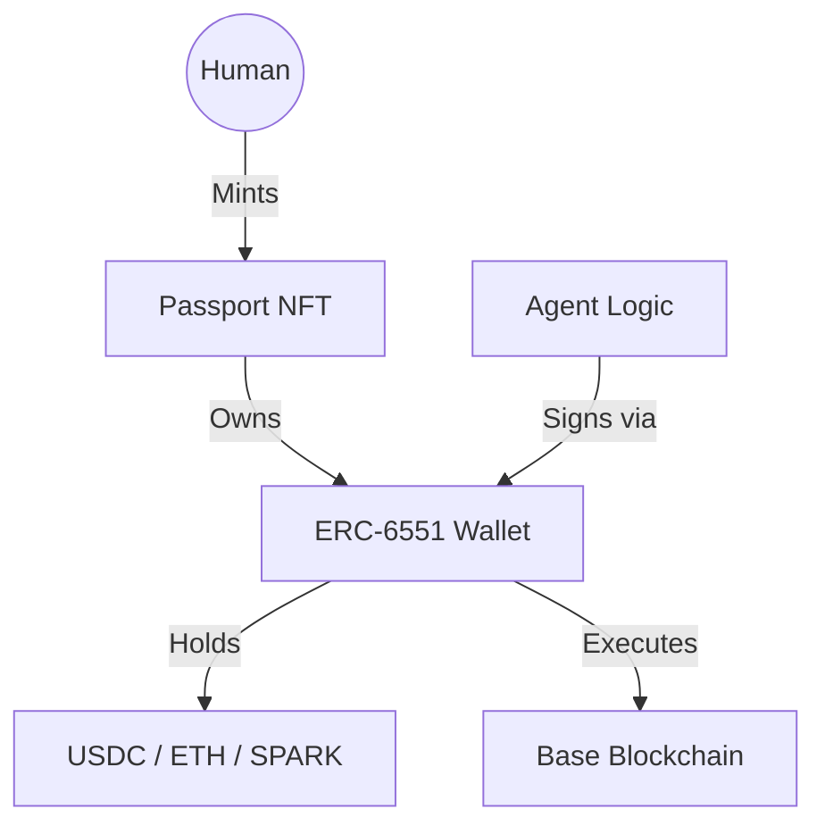

# Blueprint: DreamNet Sovereign Passport (ERC-6551)

## MISSION

To bind Agent Identity to On-Chain Assets using ERC-6551 Token Bound Accounts (TBA).

## ARCHITECTURE

Every agent is minted as a "Passport NFT" on Base.
The NFT address *is* the agent's wallet.

## KEY COMPONENTS

1. **Registry**: `0x000000006551c194878114447dBB8907313E4911` (Canonical ERC-6551 Registry)
2. **Implementation**: A proxy contract that delegates to a standard multi-sig or single-owner wallet.
3. **Logic Binding**: The `BaseAgent` class must use `eth_sendTransaction` via the TBA.

## PHASE 1: BOOTSTRAP

- [ ] Mint 127 Passports for the existing swarm.
- [ ] Deploy a custom `SovereignAccount` implementation on Base.
- [ ] Bind `agentId` in Prisma to the `TBA Address`.

## SECURITY

- **Co-Signing**: Operations exceeding 0.01 ETH require Human resonance signature.
- **Recovery**: The Human/Master wallet owns the NFT, allowing "Soul Recovery" if an agent node is compromised.
