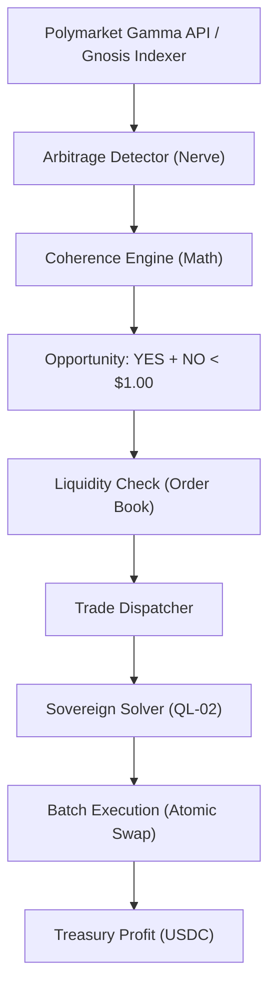

# 🏗️ Blueprint: Dutch-Book Arbitrageur (Avenue 8)

**Purpose**: To extract risk-free protocol revenue from market inefficiencies.

## 1. Architectural Overview

The Dutch-Book Arbitrageur is an automated trading module within the `Nerve` that interfaces with the `Sovereign Solver` to execute atomic arbitrage trades.

## 2. Core Components

### 2.1 The Coherence Engine

A high-integrity mathematical module that calculates the "Implied Probability" of multiple market outcomes.

- **Goal**: Identify when the `Sum(OutcomePrices) != 1.0`.

### 2.2 CLOB/Gamma Wrapper

Programmatic interface for Polymarket's Gamma API. It handles order signing (EIP-712) and monitors rate limits (Cloudflare).

### 2.3 Atomic Leg Synchronizer

Ensures that if one leg of an arbitrage trade fails (e.g., slippage on YES), the other leg (NO) is not executed, preventing directional exposure. This is delegated to the `Sovereign Solver`.

## 3. Implementation Workflow (For Lead Agent)

1. **[Nerve]**: Integrate the Polymarket Gamma API and Gnosis CTF ABI.
2. **[Heart]**: Create an `ArbitrageVault` to manage USDC collateral for prediction markets.
3. **[Security]**: Implement a "Kill Switch" if market liquidity drops below a specific threshold.

---
**Sovereign Directive**: "Mathematics is the only true oracle. We profit from its violation."
