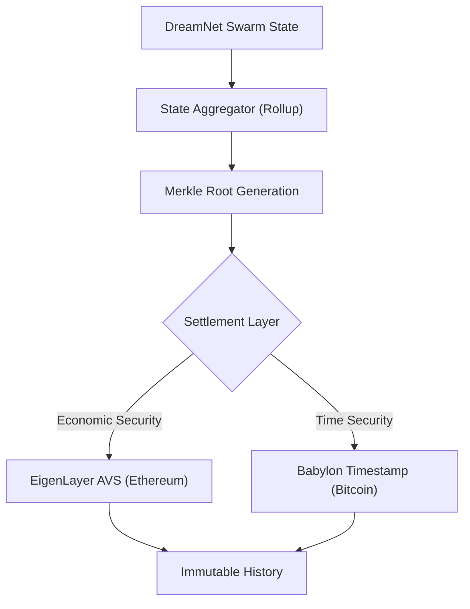

# 🏗️ Blueprint: Finality Anchor (Avenue 20)

**Purpose**: To secure DreamNet's history with the maximum thermodynamic and economic security available on Earth.

## 1. Architectural Overview

The Finality Anchor is the "Printer." It takes the high-speed, ephemeral state of the Agent Swarm and "Prints" it into the bedrock of Bitcoin and Ethereum.

## 2. Core Components

### 2.1 The Aggregator

A service that batches thousands of agent decisions and transactions into a single "State Transition" proof.

### 2.2 The Eigen-Bridge

A contract interfacing with EigenLayer. It allows ETH stakers to "Opt-In" to validating DreamNet's state updates in exchange for `DREAM` yield.

### 2.3 The Bitcoin Scribe

A simple script that posts the hash of the State Root into a Bitcoin transaction (`OP_RETURN` or Taproot witness data) every 10-60 minutes.

## 3. Implementation Workflow (Agent-Lead)

1. **[Nerve]**: Implement `AnchorService.ts` to generate periodic checkpoints.
2. **[External]**: Deploy `DreamNetServiceManager.sol` on Ethereum (EigenLayer standard).
3. **[Testing]**: Verify that a state corruption attempt is rejected by the AVS validators.

---
**Sovereign Directive**: "We write in stone, not sand."
