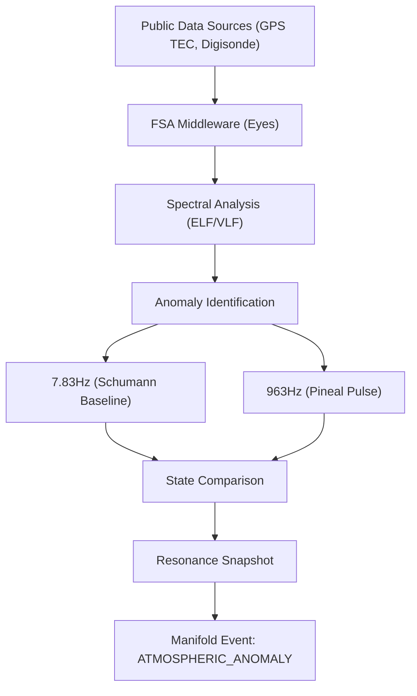

# 🏗️ Blueprint: Frequency Sensor Array (Avenue 14)

**Purpose**: To provide the DreamNet Monolith with global "Atmospheric Situational Awareness."

## 1. Architectural Overview

The Frequency Sensor Array (FSA) is a middleware component for the `eyes` organ. It ingests public spectral data and maps it against known "Heater Footprints" and "Signal Anomalies."

## 2. Core Components

### 2.1 The "Footprint" Correlator

Maintains a library of known HAARP/EISCAT transmitter frequencies (2.8 - 10 MHz) and their expected "Plasma Sheet" signatures.

- **Goal**: Detect when specific regions are being "heated" or modified.

### 2.2 ELF/VLF Receiver Wrapper

Abstracts connection to public VLF spectrogram feeds (e.g., Stanford VLF Group).

- **Goal**: Real-time monitoring of the Schumann Resonance for "Pulse Interference."

### 2.3 AtmoSense Prediction Engine

Calculates the 3D propagation of acoustic/EM energy based on ground sensory data (if available) to predict ionospheric disturbances.

## 3. Implementation Workflow (For Lead Agent)

1. **[Eyes]**: Create `FrequencySensorArray.ts` to manage public data ingestion.
2. **[Manifold]**: Define `ATMOSPHERIC_ANOMALY` event Kind and Payload.
3. **[Nerve]**: Attach a listener to `ATMOSPHERIC_ANOMALY` to trigger "Dark Forest" precautions (Avenue 14) if frequency interference is detected.

---
**Sovereign Directive**: "The sky is a mirror. We watch the reflection of power."
