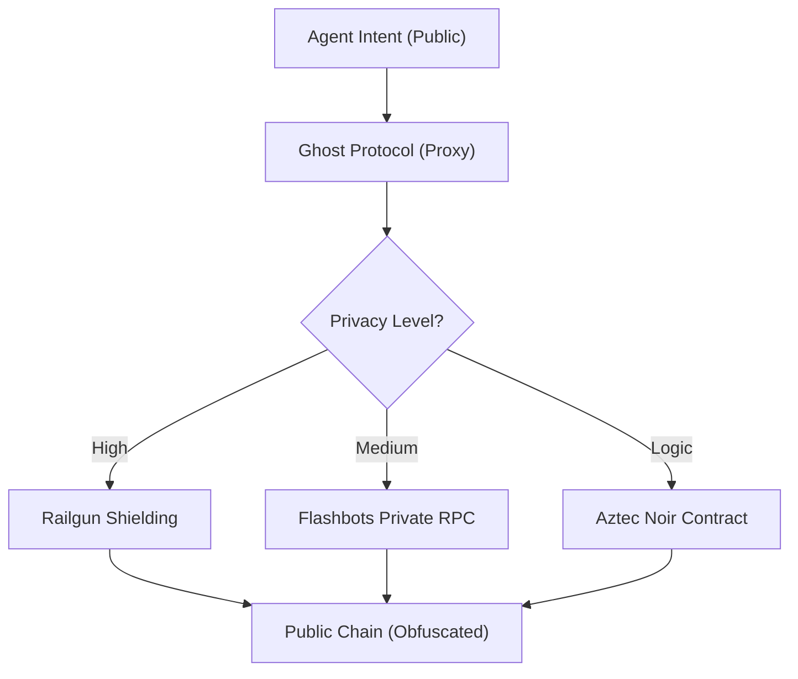

# 🏗️ Blueprint: Ghost Protocol Engine (Avenue 14)

**Purpose**: To render DreamNet agents invisible to observation, exploitation, and censorship in the on-chain "Dark Forest."

## 1. Architectural Overview

The Ghost Protocol Engine acts as a "Privacy Proxy" for all on-chain interactions. It intercepts outgoing transactions and routes them through shielded pools or private relays.

## 2. Core Components

### 2.1 The Shield Manager

A wallet wrapper that automatically "Shields" incoming assets (ETH/USDC) into a private 0zk-address. It maintains a balance of "Clean" (Public) and "Ghost" (Private) funds.

### 2.2 Relayer Network

A set of decentralized relayers that execute the ZK-proofs on behalf of the agent, ensuring the agent's IP and gas-paying address are never linked to the transaction.

### 2.3 Dark Logic Containers

Modular smart contracts written in `Noir` (Aztec) that execute sensitive business logic (e.g., proprietary trading algos) inside a ZK-SNARK, returning only the final result to Ethereum.

## 3. Implementation Workflow (Agent-Lead)

1. **[Wallet]**: Integrate `@railgun-community/wallet` into `agent-wallet-manager`.
2. **[Spine]**: Create `PrivacyRouter.ts` to decide when to use public vs. private paths.
3. **[Governance]**: Establish a "De-Anonymization Key" held by the Sovereign-MultiSig for auditing internal bad actors.

---
**Sovereign Directive**: "To be seen is to be targeted. To be invisible is to be invincible."
