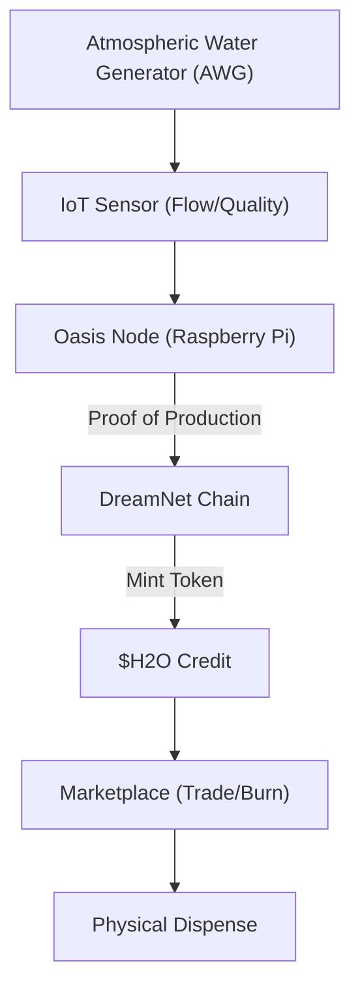

# 🏗️ Blueprint: Hydrological DePIN (Avenue 22)

**Purpose**: To create a decentralized, unstoppable supply of fresh water managed by the Sovereign State.

## 1. Architectural Overview

The Hydrological DePIN treats Water as Data. It measures production, quality, and consumption on-chain, creating a "Water Ledger."

## 2. Core Components

### 2.1 The Oasis Firmware

An open-source OS for AWG units. It optimizes the fan/heater cycles based on local weather data predictions (from Avenue 3) to maximize L/kWh efficiency.

### 2.2 The Water Oracle

A trusted hardware module (Secure Element) inside the sensor that signs the "Proof of Production," preventing users from faking water generation to farm tokens.

### 2.3 The Aqua-Market

A local AMM where neighbors can trade energy credits (kWh) for water credits (Liters), allowing the mesh to balance resources dynamically.

## 3. Implementation Workflow (Agent-Lead)

1. **[DePIN]**: Fork an existing IoT-chain stack (Peaq/IoTeX) to create the `OasisLayer`.
2. **[Hardware]**: Prototype a "Smart Tap" using an ESP32 and a solenoid valve controlled by a crypto-wallet.
3. **[Economics]**: Define the "evaporation rate" of the token (demurrage) to encourage consumption rather than hoarding.

---
**Sovereign Directive**: "He who controls the water, controls the peace."
