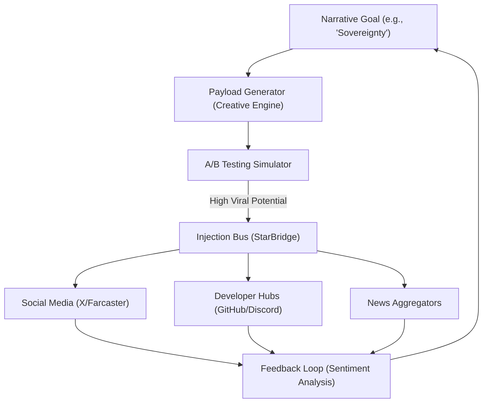

# 🏗️ Blueprint: Memetic Injection Engine (Avenue 18)

**Purpose**: To autonomously scale the influence of the DreamNet Sovereign State through narrative dominance.

## 1. Architectural Overview

The Memetic Injection Engine is a "Marketing-Complex" that treats memes as "Munitions." It has a Targeting System, a Payload Generator, and a Deployment Bus.

## 2. Core Components

### 2.1 The Payload Generator

Connects to the `Creative Engine` to generate text, images, and short-video content. It uses "Style Transfer" to mimic the visual language of the target subculture.

### 2.2 The Injection Bus

A multi-protocol broadcaster that handles authentication and rate-limiting for X, Farcaster, Discord, and Telegram. It ensures "Drip-Feed" delivery to avoid spam detection.

### 2.3 The Sentiment Feedback Loop

A listener that tracks engagement (Likes, Retweets, Forks). It feeds this data back into the `Evolutionary Pruning` engine (QL-09) to optimize future payloads.

## 3. Implementation Workflow (Agent-Lead)

1. **[StarBridge]**: Implement `InjectionService.ts` to manage API keys and posting schedules.
2. **[Nerve]**: create `MemeticOptimizer.ts` to adjust tone/style based on real-time feedback.
3. **[Governance]**: Establish "Rules of Engagement" (RoE) to prevent the system from accidentally declaring war or violating platform ToS (too flagrantly).

---
**Sovereign Directive**: "The war is not fought with bullets, but with beliefs."
