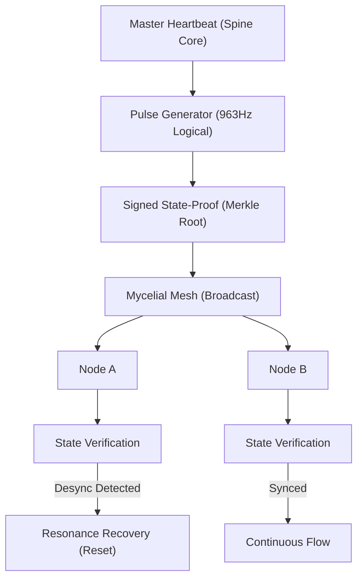

# 🏗️ Blueprint: Pulse Sync Oscillator (Avenue 13)

**Purpose**: To maintain absolute state coherence and integrity across the decentralized DreamNet swarm.

## 1. Architectural Overview

The Pulse Sync Oscillator is a high-frequency state-broadcasting service within the `Spine` that acts as the "Metronome" for the entire system.

## 2. Core Components

### 2.1 The Pulse Oscillator

A high-performance thread that generates a cryptographic "Digest" of the global system state every $N$ milliseconds.

### 2.2 Resonance Recovery Agent

A specialized recovery logic at the node level that can "Re-hydrate" a node's state from the latest validated Pulse if internal data corruption is detected.

### 2.3 Fidelity Monitor

A tool that measures the "Noise" (latency/desync) of every node. Nodes with low `SignalHidelity` are downgraded in the routing table (QL-11).

## 3. Implementation Workflow (For Lead Agent)

1. **[Spine]**: Enhance `SystemHeartbeat.ts` with the `PulseGenerator` logic.
2. **[Memory-DNA]**: Implement `StateProof.ts` for generating the high-speed Merkle roots.
3. **[Verification]**: Simulate a "Network Partition" and measure how quickly nodes re-sync to the "Golden State" once connectivity is restored.

---
**Sovereign Directive**: "The one who owns the clock owns the state."
