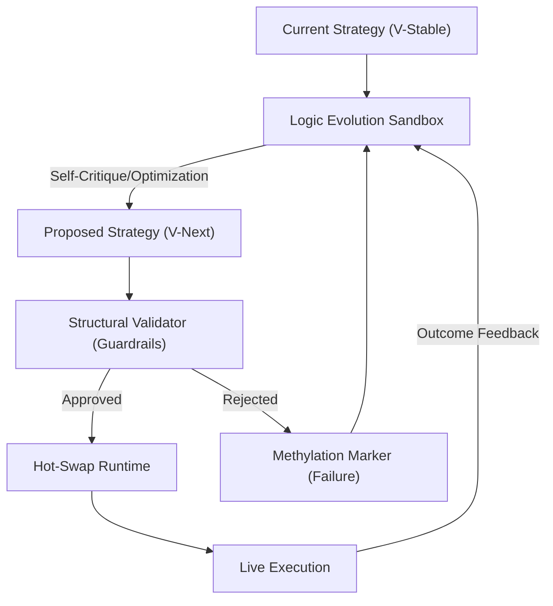

# 🏗️ Blueprint: Recursive Protocol Engine (Avenue 12)

**Purpose**: To enable safe, autonomous, and recursive self-improvement of agent logic.

## 1. Architectural Overview

The Recursive Protocol Engine is a "Compiler-in-the-Loop" for the `Nerve/Mastery` packages that manages the evolution of agent strategy modules.

## 2. Core Components

### 2.1 The Logic Sandbox

A restricted environment where the agent can generate and test new code snippets. It uses `LISP-style` homoiconicity to treat its own logic as modifiable data.

### 2.2 Structural Validator

A hard-coded layer in the `Shield` that verifies the "Proposed Strategy" matches the `Sovereign Mandates`. It prevents the agent from removing its own safety protocols or identity anchors.

### 2.3 Hot-Swap Runtime

A mechanism in the `Spine` that allows switching out the active "Logic Shard" for a new one without losing context or session state.

## 3. Implementation Workflow (For Lead Agent)

1. **[Nerve]**: Implement `EvolutionManager.ts` to coordinate the sandbox-to-runtime flow.
2. **[Shield]**: Create `MandateValidator.ts` to enforce the fixed-constraint safety layer.
3. **[Verification]**: Run "Optimization Spirals" where the agent is challenged to reduce its own latency without compromising security, and verify the validator stops any high-risk changes.

---
**Sovereign Directive**: "We do not fear evolution; we architect it."
