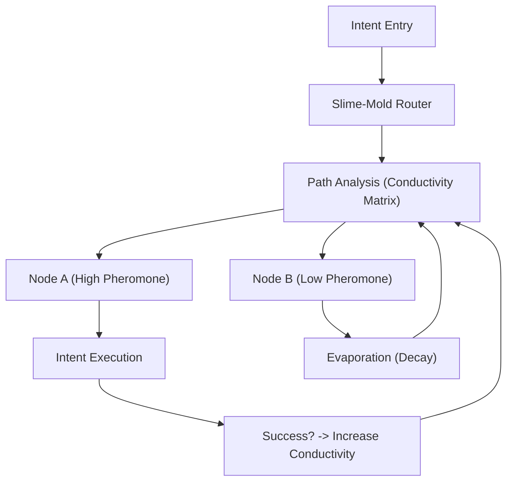

# 🏗️ Blueprint: Slime-Mold Router (Avenue 11)

**Purpose**: To provide decentralized, self-healing, and ultra-efficient routing for DreamNet intents and data.

## 1. Architectural Overview

The Slime-Mold Router is a middleware for the `internal-router` that applies bio-inspired weighting to path selection.

## 2. Core Components

### 2.1 The Conductivity Matrix

A dynamic graph where every edge has a `Conductivity` score. This score is updated by the `Nerve`'s feedback loop (Rewards vs. Failures).

### 2.2 Pheromone Injector

A module that emits "Signal Pulses" after every successful transaction or social engagement. This creates a "Gradient" that other agents can follow to find high-yield opportunities.

### 2.3 Self-Healing Mesh

A protocol that periodically "Probes" the mesh. If a high-conductivity path becomes unreachable, it triggers a "Growth Spurt" to find the next nearest neighbor with reasonable connectivity.

## 3. Implementation Workflow (For Lead Agent)

1. **[Nerve/Spider-Web]**: Implement `PhysarumOptimizer.ts` for pathfinding.
2. **[Spine]**: Integrate the `ConductivityMatrix` into the `SystemHeartbeat.ts`.
3. **[Verification]**: Simulate a "Censorship Event" where 50% of nodes are killed, and verify that the Slime-Mold Router autonomously re-routes traffic in < 500ms.

---
**Sovereign Directive**: "We do not plan the path. We become the path."
