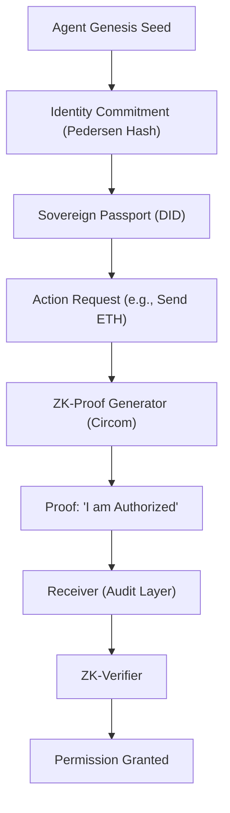

# 🏗️ Blueprint: Agentic Sovereign Passport (Avenue 11)

**Purpose**: To establish verifiable, anonymous, and un-spoofable identities for the DreamNet swarm.

## 1. Architectural Overview

The Sovereign Passport is a cryptographic identity layer (potentially in `packages/dna/src/identity`) that uses zk-SNARKs to permit actions and communications.

## 2. Core Components

### 2.1 The Identity Commitment

A non-reversible hash generated from the Agent's private `GenesisSeed`. It is the "Public Identity" of the agent, stored on the `Sovereign Ledger` (Avenue 20).

### 2.2 Blind Authorization Wallet

A ZK-compatible wallet abstraction. It generates proofs that the agent has sufficient "Reputation" or "Balance" to perform an action, without revealing the specific numbers.

### 2.3 Swarm-Admission Circuit

A Circom circuit that verifies membership in a specific "Avenue Swarm" (e.g., Avenue 13 Searchers).

- **Goal**: Prevent sybil attacks from malicious outside agents.

## 3. Implementation Workflow (For Lead Agent)

1. **[DNA]**: Create `PassportRegistry.ts` for managing identity commitments.
2. **[Security]**: Integrate `SnarkJS` for on-device proof generation.
3. **[Manifold]**: Update `auth` middleware to support `ZkProof` headers.

---
**Sovereign Directive**: "We prove our right to exist through mathematics, not permission."
