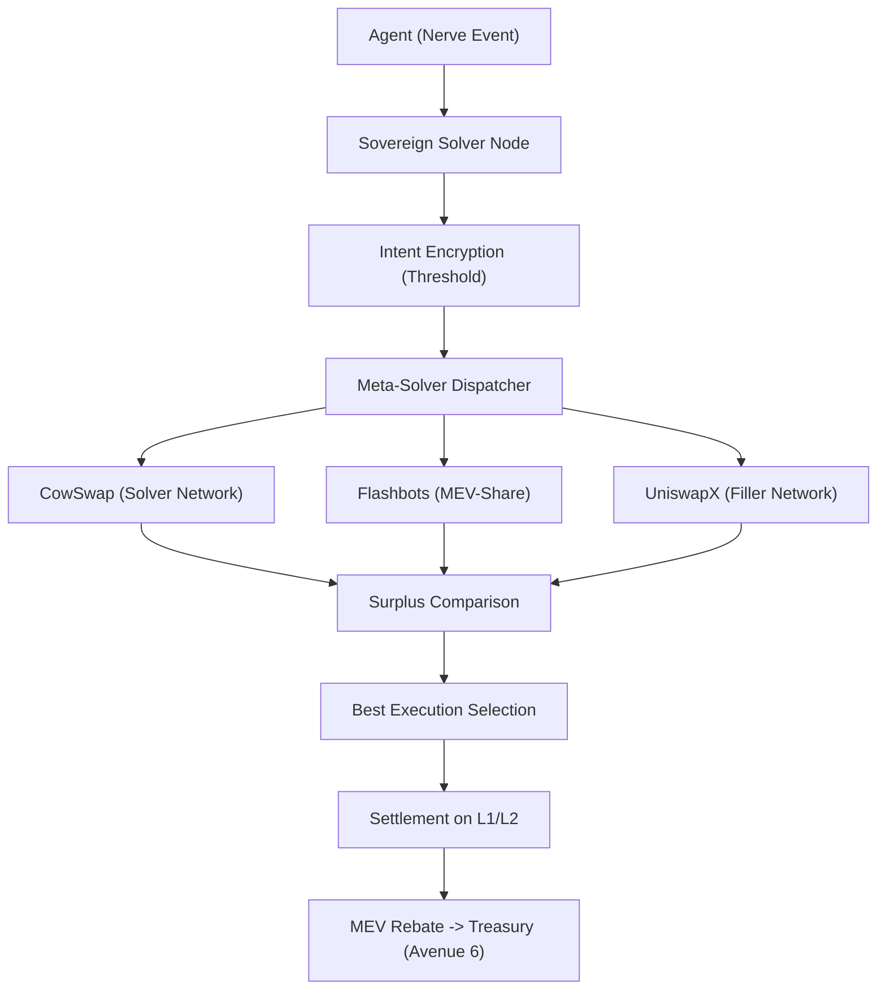

# 🏗️ Blueprint: The Sovereign Solver (Avenue 13/17)

**Purpose**: To provide the DreamNet Monolith with absolute execution sovereignty in hostile EVM environments.

## 1. Architectural Overview

The Sovereign Solver is a middleware layer within the `nerve` package (potentially `packages/nerve/src/solver`) that abstracts transaction execution into **Permissionless Intent Resolution**.

## 2. Core Components

### 2.1 Intent Encryption Layer

Uses a Shutter-network style threshold encryption scheme. The transaction payload is encrypted off-chain and only decrypted by block builders who have committed to a "Fair-Ordering" protocol.

- **Effect**: Eliminates pre-execution front-running.

### 2.2 Meta-Solver Dispatcher

A multi-broadcast engine that converts standard transactions into the specific intent formats of CowSwap, Flashbots, and other OFAs.

- **Effect**: Forces competition between solver networks for the Monolith's order flow.

### 2.3 The "Reflex Auditor" (Avenue 20)

Processes the proposed execution from external solvers through a local simulation (via `eth_call` or Tenderly). If the "Surplus" offered is lower than the Monolith's internal estimation, the intent is cancelled or re-routed.

## 3. Implementation Workflow (For Lead Agent)

1. **[Nerve]**: Create `IntentGenerator.ts` to convert `NerveEvent` to atomic intents.
2. **[Reflex]**: Implement `SolverAuditService.ts` for real-time surplus validation.
3. **[Treasury]**: Attach a listener to `MEV_REBATE_RECURRENCE` events to harvest backrun surpluses.

---
**Sovereign Directive**: "We do not bid for inclusion. We audit for surplus."
