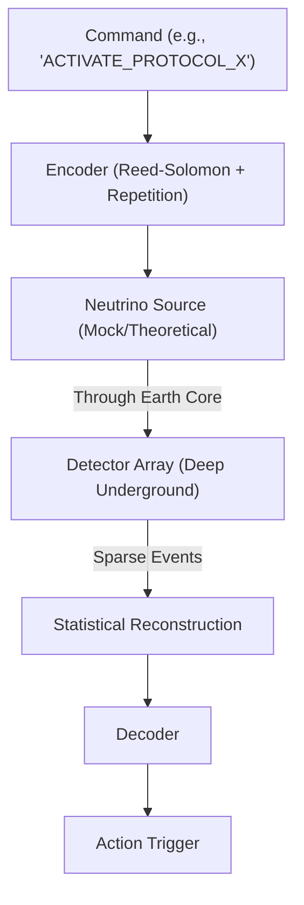

# 🏗️ Blueprint: Sub-Terra Signaling Protocol (Avenue 23)

**Purpose**: To establish an unblockable, unstoppable command-and-control channel for the Sovereign State.

## 1. Architectural Overview

The Sub-Terra Protocol is a robust, low-bandwidth standard (like Morse code) designed for high-noise enviroments. It assumes 99.9% packet loss and relies on massive redundancy.

## 2. Core Components

### 2.1 The Hachimoji Encoder

Using the 8-letter Hachimoji DNA code (QL-10) as a robust alphabet for neutrino pulse timing. The extra density allows for more information per "burst."

### 2.2 The Coincidence Filter

A software layer that filters out cosmic ray background noise by looking for "Coincident" signals from multiple detectors simultaneously (e.g., widely separated DreamNet nodes).

### 2.3 The Latency Arbitrageur

A trading bot specialized in calculating the "Chord Distance" (straight line through Earth) vs "Surface Distance" (fiber) to execute trades milliseconds before the rest of the market.

## 3. Implementation Workflow (Agent-Lead)

1. **[Nerve]**: Create `SubTerraSim.ts` to simulate neutrino packet loss and latency advantages.
2. **[Encryption]**: Implement One-Time Pad encryption for these low-bandwidth messages (perfect secrecy for short commands).
3. **[Hardware]**: Monitor Muon Detector projects (CosmicWatch) for potential DIY receiver capabilities.

---
**Sovereign Directive**: "Walls stop light. Nothing stops us."
