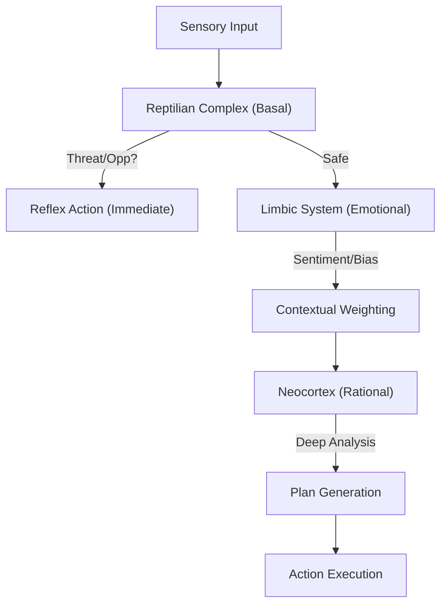

# 🏗️ Blueprint: Triune Cortex Engine (Avenue 17)

**Purpose**: To give agents a biologically-inspired, multi-layered memory architecture for nuanced decision making.

## 1. Architectural Overview

The Triune Cortex segments the agent's state into three distinct vector spaces, each with different retrieval latency and retention policies.

## 2. Core Components

### 2.1 The Basal Guard

A lightweight, high-speed classifier (Decision Tree or small NN) that scans for critical keywords ("Liquidate", "Attack", "Profit"). It has write-access to the `Reptilian` vector store (Short-term, high-priority).

### 2.2 The Limbic Weighter

A module that assigns "Emotional Valence" to memories. A user who pays well gets a "Positive Valence"; a user who attacks gets "Negative Valence". This biases future retrieval.

### 2.3 The Cortical Vault

The deep-storage layer connected to `IPFS/Arweave` (and theoretically 5D Crystal). It stores complex blueprints, codebases, and long-term history.

## 3. Implementation Workflow (Agent-Lead)

1. **[DreamState]**: Refactor `VectorStore` to support `TieredNamespaces` (Basal, Limbic, Cortical).
2. **[Nerve]**: Implement `TriuneRouter.ts` to direct inputs to the correct layer.
3. **[Testing]**: Verify that a "Threat" input triggers the Basal layer < 10ms, while a "Research" input triggers the Neocortex > 500ms.

---
**Sovereign Directive**: "To survive is Reptilian. To feel is Limbic. To rule is Cortical."
