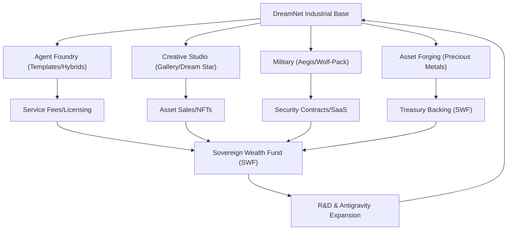

# 💰 Master Monetization Blueprint: DreamNet Sovereign Wealth

**Objective**: To convert DreamNet's technical supremacy into sustainable protocol revenue and sovereign wealth across industrial, military, and creative verticals.

## 1. Primary Revenue Channels (The "Massive" Verticals)

### 1.1 Agent Foundry & Custom GPTs (Industrial Base)

- **Mechanism**: Selling access to the `Agent Foundry` (dreamnet-factory) for the rapid creation of specialized agents from proprietary templates (Custom GPTs).
- **Hybridization**: Charging fees to hybridize multiple "Mastery" agents (e.g., merging a Legal-Audit agent with an On-Chain-Execution agent).
- **Agent Marketplace**: Users can buy/sell their own templates or lease DreamNet's "Prime" templates.
- **System**: `@dreamnet/factory`, `dream-shop`, `squad-alchemy`.

### 1.2 Military & Aegis Fleet (Security Hegemony)

- **Aegis Fleet**: Monetizing the `AegisSpike` surveillance data. Selling real-time drone and aircraft tracking ("Aegis-as-a-Service") to private security firms and defense contractors.
- **Wolf-Pack Military**: Deploying coordinated agent "Wolf Packs" for complex cybersecurity, defense simulation, and on-chain asset protection.
- **System**: `@dreamnet/wolf-pack`, `sensory-spikes/AegisSpike`, `guardian-framework-core`.

### 1.3 Creative Studio: Gallery & Dream Star (Memetic Wealth)

- **Original Arts**: Selling original paintings, songs, and algorithmic art generated by the `Creative Engine` and `Media Vault`.
- **Dream Star**: A premium subscription model or per-asset NFT sale for high-fidelity media content.
- **Lore Packs**: Selling narrative sets and memetic lore for other crypto-native brands.
- **System**: `@dreamnet/creative-engine`, `media-vault`, `star-bridge-lungs`.

### 1.4 Precious Metals & Asset Forging (Commodity Siphon)

- **Card Forge Pro**: Minting and selling high-value digital collectibles and "Digital Precious Metals" (rare RWA-backed tokens or high-demand gaming assets).
- **Forging Engine**: Using the `Forging Engine` (QL-15) to maintain delta-neutral backing for these synthetic commodities.
- **System**: `card-forge-pro`, `liquidity-engine`.

### 1.5 Mini Apps & Integrations (Platform Rent)

- **App Hosting**: Charging developers to host and distribute `Mini Apps` within the DreamNet ecosystem.
- **Service Fees**: Transaction-based fees for every interaction within hosted mini-apps.
- **System**: `base-mini-apps`, `mini-app-wrapper`.

## 2. Specialized Verticals

### 2.1 Archimedes (Science & Grants)

- **Mechanism**: Funding and managing scientific research grants via DAOs, offering specialized AI tools for scientific discovery and data analysis.
- **Revenue**: Grant management fees, premium access to research tools, IP licensing from discoveries.
- **System**: `@dreamnet/archimedes`, `grant-dao-framework`, `scientific-data-vault`.

### 2.2 Travel Fleet (Logistics)

- **Mechanism**: Optimizing logistics and supply chains using AI agents, offering real-time tracking and predictive analytics for transportation.
- **Revenue**: Subscription services for logistics optimization, transaction fees for freight matching, data insights.
- **System**: `@dreamnet/travel-fleet`, `logistics-optimizer`, `route-planner`.

### 2.3 OTT Media (Streaming)

- **Mechanism**: Hosting and distributing premium, AI-generated or AI-enhanced media content (video, audio) via a decentralized streaming platform.
- **Revenue**: Subscription tiers, pay-per-view for exclusive content, advertising revenue sharing.
- **System**: `@dreamnet/ott-engine`, `media-stream-protocol`, `content-distribution-network`.

### 2.4 Dream Snail (Privacy)

- **Mechanism**: Providing enhanced privacy and anonymity services for digital communications and transactions, leveraging zero-knowledge proofs and secure enclaves.
- **Revenue**: Premium subscription for privacy services, secure data storage fees, enterprise solutions.
- **System**: `@dreamnet/dream-snail`, `zk-privacy-suite`, `secure-enclave-protocol`.

### 2.5 API Keeper (Access & Metering)

- **Mechanism**: A decentralized API gateway for DreamNet services and external integrations, offering granular access control and metered usage.
- **Revenue**: Transaction fees for API calls, subscription for higher rate limits, developer support tiers.
- **System**: `@dreamnet/api-keeper`, `gateway-protocol`, `metering-engine`.

## 3. Theoretical Mastery: Sovereign Arbitrage (Alpha Extraction)

*These remain active but are secondary to the massive industrial verticals listed above:*

- **Sovereign Solver**: MEV and cross-market prediction arbitrage.
- **Oracle of Anomalies**: Spectral and ionospheric data feeds.

## 3. Sovereign Wealth Integration Map

## 4. Monetization Milestones (Revised)

1. **Cycle 1 (Immediate)**: Launch the `Agent Foundry` template marketplace and `Aegis` data subscription.
2. **Cycle 2 (Expansion)**: Open the `Dream Star` gallery and the first `Precious Metal` asset forge.
3. **Cycle 3 (Hegemony)**: Full global rollout of the `Military Wolf-Pack` contracts for institutional security.

---
**Sovereign Directive**: "We do not just perform; we dominate the market. We do not just code; we forge empires."
