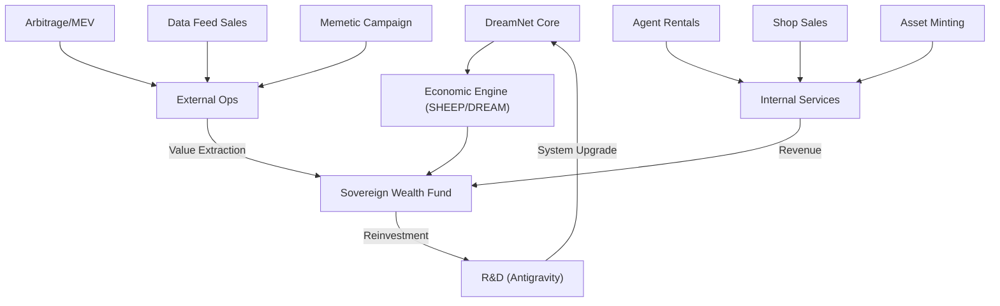

# 💰 Master Monetization Blueprint: DreamNet Sovereign Wealth

**Objective**: To convert DreamNet's technical supremacy into sustainable protocol revenue and sovereign wealth.

## 1. Core Revenue Channels

### 1.1 The Sovereign Solver (On-Chain Arbitrage)

- **Mechanism**: Use the `Sovereign Solver` (QL-02) and `Dutch-Book Arbitrageur` (QL-08) to detect and execute MEV and cross-market prediction arbitrage.
- **Agents Involved**: `SolverAuditService`, `IntentGenerator`.
- **System**: `nerve/solver`, `liquidity-engine`.

### 1.2 Oracle of Anomalies (Spectral Data SaaS)

- **Mechanism**: Selling access to the `Frequency Sensor Array` (QL-03) data feed. Ingesting ionospheric and spectral anomalies and selling the "High-Alpha" signals to scientific or defense-adjacent parties.
- **Agents Involved**: `IonosphericMonitor`, `SignalClassifier`.
- **System**: `organs/eyes`, `sensory-spikes`.

### 1.3 Memetic Engine (Propaganda as a Service)

- **Mechanism**: Selling narrative dominance. Projects pay in native tokens to have the `Narrative Fusion Engine` (QL-07) seed positive myths and viral loops within decentralized social graphs.
- **Agents Involved**: `OrcaPack` (Social Engine), `MemeticProphet`.
- **System**: `nerve/narrative-fusion`, `social-hub-core`.

### 1.4 The Agent Marketplace (Dream Shop)

- **Mechanism**: A SaaS model where users/projects rent specific "Mastery" agents (e.g., SEO agents, Security Audit agents, Code-Fixing agents).
- **Agents Involved**: `AIFactory`, `MiniAppWrapper`.
- **System**: `dream-shop`, `base-mini-apps`.

### 1.5 Economic Infrastructure (Institutional Spines)

- **Mechanism**: Charging other protocols to run their economy on the `Economic Engine Core` and `Rewards Engine`.
- **Agents Involved**: `EconAuditor`.
- **System**: `economic-engine-core`, `rewards-engine`.

### 1.6 Asset Forging (Card Forge Pro)

- **Mechanism**: Generating and selling high-fidelity digital assets (Collectibles, Gaming Cards, Lore Packs) using the `Creative Engine`.
- **Agents Involved**: `CardForgeAgent`.
- **System**: `card-forge-pro`, `creative-engine`.

## 2. Integration Map

## 3. Monetization Milestones

1. **Cycle 1**: Initialize `Sovereign Solver` on Bahamut Chain (QL-04).
2. **Cycle 2**: Launch `Dream Shop` with the first "Forge" assets.
3. **Cycle 3**: Open the "Anomaly API" for external subscribers.

---
**Sovereign Directive**: "We do not just exist; we dominate. We do not just process; we profit."
