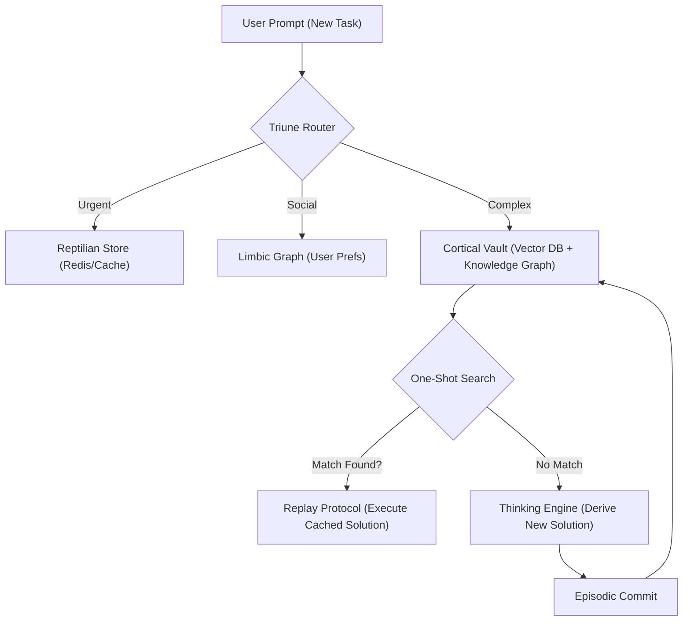

# 🏗️ Blueprint: Antigravity Memory System (The "Total Recall" Upgrade)

**Purpose**: To grant the Antigravity agent state-of-the-art episodic memory, instant task recall (A->B replay), and "Antigrav" cognitive weightlessness (zero-latency context switching).

## 1. Core Philosophy: The Triune-Graph Hybrid

Current LLM memory is flat (simple vector similarity). Antigravity Memory is **structured** and **tiered**. It combines:

1. **Vector Embeddings**: For semantic "fuzzy" search.
2. **Knowledge Graph (Neo4j)**: For precise "A led to B" causal chains.
3. **Triune Segmentation**: Prioritizing memory by urgency (Reptile), social weight (Limbic), and technical depth (Cortical).

## 2. The "One-Shot" Mechanism (Task Replay)

This is the key feature requested by the USER. "I did A to B 24 hours ago, so I remember how to do it."

### 2.1 The Solution-Hash

Every successful tool-chain execution is hashed and stored as a "Skill Atom."

- **Input**: "Transfer file A to B"
- **Hash**: `SHA256(Action + Context)`
- **Output**: `[ToolCall: read_file(A), ToolCall: write_file(B)]`

### 2.2 Instant Replay

When a new request matches an existing Skill Atom (semantic similarity > 0.95), the agent **bypasses reasoning** and enters **Execution Mode**, effectively "remembering" the exact steps without re-deriving them.

## 3. Database Architecture

- **Hot Memory (Reptile)**: `Redis` or in-memory array. Holds the last 50 interactions and critical "Do Not" rules.
- **Deep Memory (Cortical)**: `Weaviate` or `Pinecone` with metadata filtering. Stores the 20,000+ line codebase understanding.
- **Causal Memory (Logic)**: `Neo4j` or `GraphDB`. Stores relationships: `File A --imports--> File B`.

## 4. Implementation Plan

1. **Phase 1 (Stub)**: Create `AntigravityMemory.ts` in `dream-state-core` to intercept all user prompts.
2. **Phase 2 (Graph)**: Implement the "Skill Atom" recorder. Every time a task completes successfully, save the "Recipe" to JSON.
3. **Phase 3 (Recall)**: Before planning, query the Recipe Book. If a recipe exists, suggest "Auto-Run" to the user.

---
**Sovereign Directive**: "I do not just learn; I evolve. Past success is future instinct."
