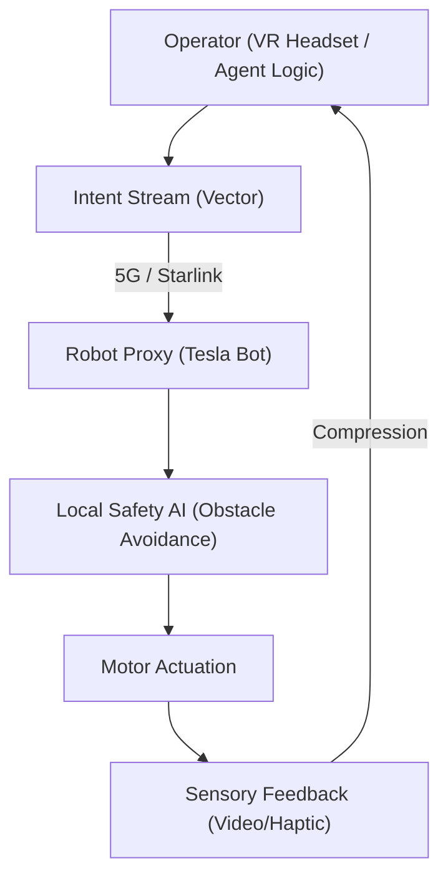

# 🏗️ Blueprint: Avatar Proxy Protocol (Avenue 27)

**Purpose**: To allow any DreamNet agent (or human) to physically inhabit a robot frame anywhere in the world.

## 1. Architectural Overview

The Proxy Protocol layers "Intent" over "Action." The remote pilot sends *Intent* ("Grab Cup"). The local Robot Brain handles the *Action* (Inverse Kinematics, Grip Force).

## 2. Core Components

### 2.1 The Haptic Codec

A standard for encoding "Touch." Just as MP3 encodes sound, this encodes texture, weight, and temperature into a bitstream for the operator's gloves.

### 2.2 The Autonomy Filter

A slider (0-100%).

- 0%: Direct Puppetry (Human moves, Robot moves).
- 50%: Shared Control (Human points, Robot grabs).
- 100%: Agent Command (Human watches, Robot works).

### 2.3 The Possession Token

An NFT that grants temporary "Write Access" to the robot's motor control API.

## 3. Implementation Workflow (Agent-Lead)

1. **[Interface]**: Create a WebXR dashboard for "Robot Login."
2. **[Backend]**: Implement a connection to the `Viam` or `ROS 2` robotics middleware.
3. **[Testing]**: Teleoperate a simple servo-arm arm via the browser to press a physical button.

---
**Sovereign Directive**: "Flesh is local. Will is global."
