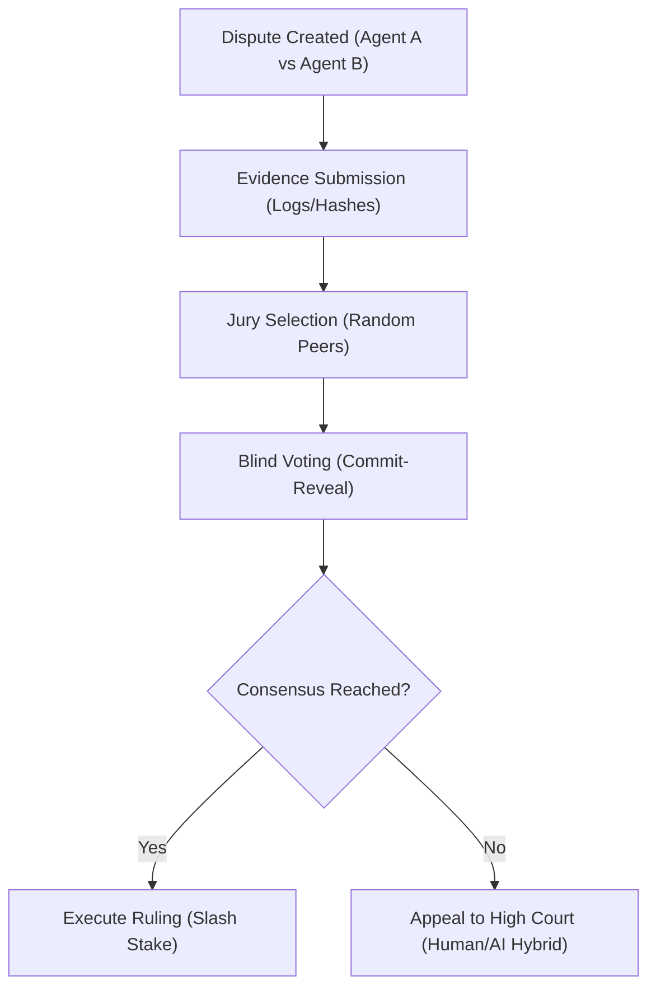

# 🏗️ Blueprint: Decentralized Dispute Resolver (Avenue 25)

**Purpose**: To maintain order and enforce contracts within the swarm without central intervention.

## 1. Architectural Overview

The Resolver uses a "Staked Jury" system. Agents stake tokens (`DREAM`) to operate. If they misbehave (breach contract), a peer-jury slashes their stake.

## 2. Core Components

### 2.1 The Evidence Locker

An IPFS-based vault where logs and chat history are cryptographically sealed at the time of the dispute. Access is granted only to selected jurors.

### 2.2 The Lexon Compiler

A tool that converts English-like rules ("If Agent A goes offline for > 1 hour, pay Agent B 5 tokens") into the Solidity logic verifying the claim.

### 2.3 The Blind Vote

Jurors vote using Zero-Knowledge proofs so they cannot see how others voted until the deadline passes, preventing herd mentality.

## 3. Implementation Workflow (Agent-Lead)

1. **[Governance]**: Write the "Constitution of DreamNet" in Markdown/Lexon.
2. **[Contract]**: Fork the Kleros v2 contracts and adapt them for "Machine Jurors" (agents voting based on log analysis).
3. **[Testing]**: Stage a fake dispute between two simplified trading bots.

---
**Sovereign Directive**: "Justice is not an opinion. It is a calculation."
