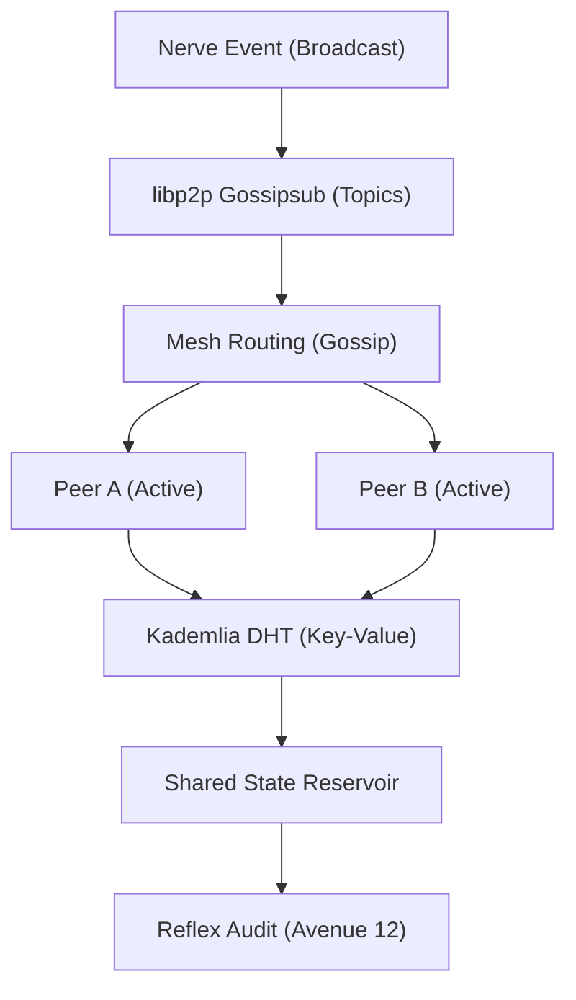

# 🏗️ Blueprint: Elastic Mesh Node (Avenue 9)

**Purpose**: To turn the DreamNet Monolith into a globally distributed, un-killable swarm.

## 1. Architectural Overview

The Elastic Mesh Node is a P2P networking wrapper (potentially in `packages/nerve/src/network`) that uses libp2p to maintain a shared state between all active agents.

## 2. Core Components

### 2.1 Gossipsub Multi-Topic Bus

Defines priority topics (e.g., `/dreamnet/v1/tx`, `/dreamnet/v1/sensing`).

- **Goal**: Low-latency propagation of "High Intensity" events.

### 2.2 Kademlia Discovery Layer

Automatically discovers local (LAN) and remote (WAN) peers.

- **Goal**: Zero-config swarm expansion.

### 2.3 Decentralized State Mirror

Wraps the `MammalLayer` (Associative Memory). Every memory saved locally is asynchronously replicated to the DHT `G` nodes closest to its hash.

## 3. Implementation Workflow (For Lead Agent)

1. **[Nerve]**: Integrate `@libp2p/gossipsub` and `@libp2p/kad-dht`.
2. **[Spine]**: Update `EventEnvelope.ts` to include P2P routing metadata.
3. **[Deployment]**: Create `NodeBootstrapService.ts` to handle initial discovery (Avenue 19).

---
**Sovereign Directive**: "One node is a target. A thousand nodes is a mycelium."
