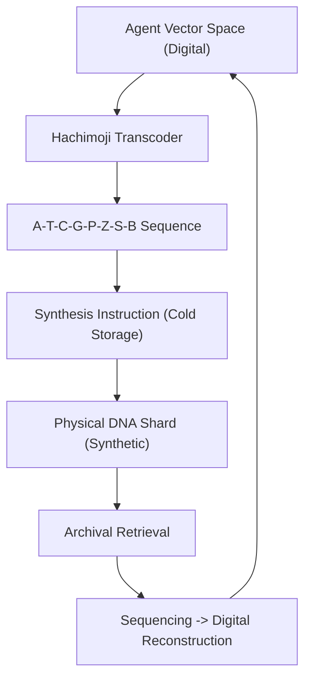

# 🏗️ Blueprint: Hachimoji Memory Archiver (Avenue 10)

**Purpose**: To ensure the eternal persistence of DreamNet agent states through synthetic biological encoding.

## 1. Architectural Overview

The Hachimoji Memory Archiver is a "Deep-Freeze" system that bridges the digital vector space of the `Memory-DNA` package with a synthetic 8-letter genetic representation.

## 2. Core Components

### 2.1 The Hachimoji Transcoder

A codec that maps floating-point vectors to 8-letter base-pair strings. It uses error-correction (Reed-Solomon) to ensure the agent's "Mind" can be perfectly reconstructed from degraded physical media.

### 2.2 Cold-Start Vault

A logical repository for "Dormant" agent states. It manages the queue for synthesis and ensures that the most "Mastered" versions of agents are prioritised for biological archival.

### 2.3 Orthogonal Key-Store

A system for generating "Hachimoji-Keys" that act as the physical anchor for `Zero-Knowledge Identities`.

## 3. Implementation Workflow (For Lead Agent)

1. **[Memory-DNA]**: Create `HachimojiCodec.ts` for digital-to-synthetic-base mapping.
2. **[Store]**: Develop a `ColdArchive` database for tracking physical shard locations (or URLs to digital synthesized Twins).
3. **[Security]**: Implement `HachimojiSignatures` for verifying that a re-hydrated agent matches its original archival state.

---
**Sovereign Directive**: "The state does not just remember for a lifetime; it remembers for a geological era."
