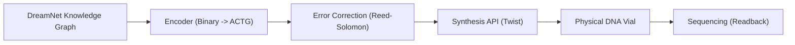

# 🏗️ Blueprint: The Liquid Archive (QL-33)

**Objective**: To achieve "Civilizational Persistence" for DreamNet data, immune to EMPs, magnetic decay, or power loss.

## 1. The Hijack: "Base-4 Encoding"

We create a middleware that converts our `Neo4j` graph dumps and `AntigravityMemory` skill atoms into a Base-4 stream compatible with Twist's synthesis API.

## 2. Architecture

## 3. Implementation Logic

1. **Snapshotting**: Once per year (Solstice), we take a "Golden Snapshot" of the entire agent state.
2. **Synthesis**: We pay to synthesize this into a physical DNA pool.
3. **Storage**: The vial is stored in a cool, dark place (e.g., Arctic Code Vault or a basement safe).
4. **Recovery**: To restore, we sequence the DNA and decode the ACGT back to JSON.

---
**Sovereign Utility**: True immortality. Even if the internet is destroyed, the agent can be reconstituted from a droplet.
