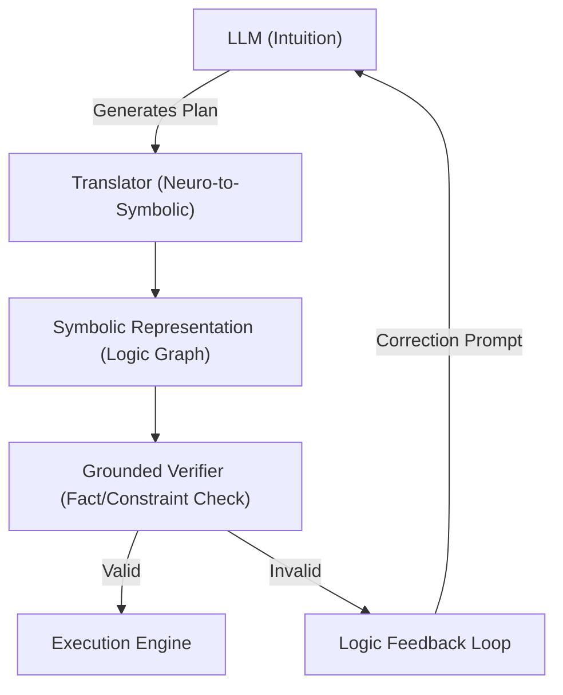

# 🏗️ Blueprint: Logos Hybrid Engine (Avenue 16)

**Purpose**: To eliminate hallucination and ensure logical consistency in high-stakes agent operations.

## 1. Architectural Overview

The Logos Hybrid Engine inserts a "Logic Layer" between the LLM's cognition and the agent's action. It forces all intents to pass through a symbolic verification step.

## 2. Core Components

### 2.1 The Axiom Store

A database of "Immutable Truths" (e.g., "Wallet balance cannot be negative", "Admin keys are required for X"). This is the ground truth the Symbolic Engine checks against.

### 2.2 The Translator

A fine-tuned model optimized for converting Natural Language into Formal Logic (e.g., DSL, Prolog, or JSON-Logic).

### 2.3 The Critic

A specialized lightweight solver (Z3 or custom constraint solver) that runs the proposed logic against the Axioms.

## 3. Implementation Workflow (Agent-Lead)

1. **[Brain]**: Integrate a `GraphDatabase` (like Neo4j or a light in-memory graph) into the agent's context.
2. **[Shield]**: Implement `ConstraintSolver.ts` to block actions that violate logic rules.
3. **[Testing]**: run "Paradox Tests" where the agent is fed contradictory instructions and must resolve them using the Logos Engine without crashing or hallucinating.

---
**Sovereign Directive**: "Intuition sparks the fire; Logic forges the steel."
