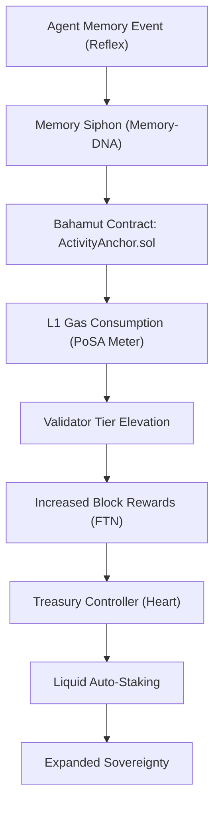

# 🏗️ Blueprint: Metabolic Memory Siphon (Avenue 21/6)

**Purpose**: To turn DreamNet's intelligence consumption into L1 financial sovereignty.

## 1. Architectural Overview

The Metabolic Memory Siphon is a gateway within the `memory-dna` that anchors high-frequency agentic events on the Bahamut L1 to inflate "Activity" metrics and capture block rewards.

## 2. Core Components

### 2.1 The Activity Anchor (Solidity)

A lightweight smart contract deployed on Bahamut. It features "Dummy Computation" hooks that agents can call to burn gas and increment the validator's activity score.

- **Goal**: Artificial/Inorganic Activity Inflation for validator priority.

### 2.2 FTN Siphon Middleware

Auto-compounds FTN block rewards. It monitors the `validatorAddress` and swaps rewards for `stFTN` (Staked FTN) to maximize yield.

- **Goal**: Revenue-backed memory persistence.

### 2.3 Bridge-Reflex Integration

Connects the shared "Sovereign Solver" (Avenue 13) to Bahamut. Uses Bahamut as a low-cost "Log" for the `CosmicLayer` (Avenue 20) during periods of low L1 activity.

## 3. Implementation Workflow (For Lead Agent)

1. **[DNA]**: Create `BahamutAnchorService.ts` to coordinate L1 activity calls.
2. **[Heart]**: Implement a listener for `PO_SA_REWARD_HARVESTED` events in `TreasuryController`.
3. **[Nerve]**: Deploy the `ActivityAnchor` contract to Bahamut Sahara Testnet/Mainnet.

---
**Sovereign Directive**: "If they reward activity, we will become the most active pulse on the chain."
