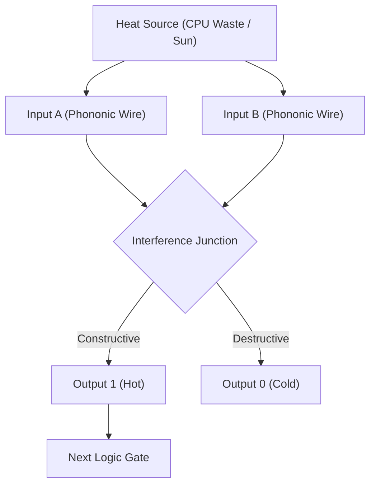

# 🏗️ Blueprint: Thermal Logic Gate (Avenue 29)

**Purpose**: To build computation that survives EMPs, radiation, and extreme heat.

## 1. Architectural Overview

The Thermal Gate uses "Phononic Crystals"—materials with a periodic structure that blocks sound at specific frequencies (bandgaps). By heating/cooling parts of the crystal, we shift the bandgap, allowing the signal to pass (1) or stop (0).

## 2. Core Components

### 2.1 The Nanolattice

A 3D-printed microscopic scaffold (using Avenue 24 tech) that directs heat flow like a waveguide directs light.

### 2.2 The Acoustic Transistor

A mechanical switch that vibrates to let phonons pass only when a control signal (another vibration) is applied.

### 2.3 The "Whispering Gallery" Memory

A circular ring where sound waves spin endlessly with near-zero loss, storing data as prolonged echoes.

## 3. Implementation Workflow (Agent-Lead)

1. **[Simulation]**: Use `COMSOL Multiphysics` to design a phononic bandgap structure.
2. **[Hardware]**: 3D print a macro-scale version using different density plastics to demonstrate "Sound Diode" behavior.
3. **[Encryption]**: Propose a "Silent Key" standard where private keys are generated by acoustic noise, undetectable by EM sniffers.

---
**Sovereign Directive**: "In the silence, we calculate."
