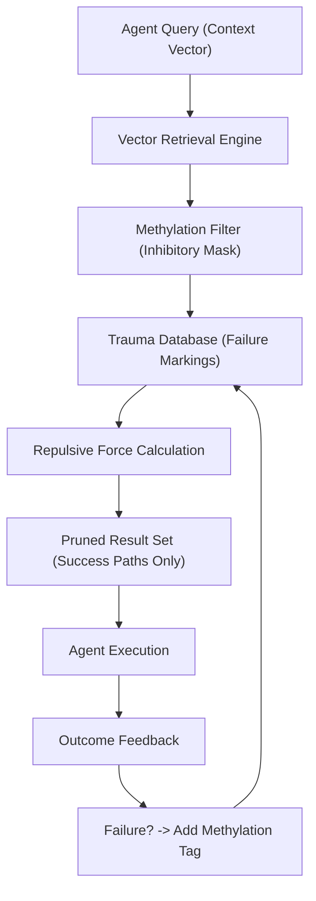

# 🏗️ Blueprint: Vector Methylation Engine (Avenue 22)

**Purpose**: To prevent evolutionary regression and ensure high-integrity recursive self-improvement.

## 1. Architectural Overview

The Vector Methylation Engine is a "Middleware" for the `Memory-DNA` package that intercepts vector queries and applies an inhibitory mask based on historical failure data.

## 2. Core Components

### 2.1 The Methylation Tagger

A module that listens to the `Heart`'s failure signals. If a blueprint execution fails or a trade is liquidated, it calculates the "Embeddings" of the failure context and stores them in a **Negative Memory Index**.

### 2.2 Repulsive Retrieval System

A modification to the standard Vector Search (Cosine Similarity). It uses a "Penalized Similarity" score where proximity to a methylated vector drastically reduces the ranking of a potential action.

- **Goal**: Autonomous instinctual failure avoidance.

### 2.3 Historical Innovation Tracker (HIT)

Based on NEAT architecture, it tracks every logic change with unique IDs. This allows the system to "Roll Back" to the last stable "Genotype" before a methylation event occurred.

## 3. Implementation Workflow (For Lead Agent)

1. **[Memory-DNA]**: Implement `MethylationIndex.ts` for storing repulsive vectors.
2. **[Nerve/Mastery]**: Add a `methylate()` method to the agentic workflow to mark failure states.
3. **[Verification]**: Run "Trauma Simulations" where the agent is forced into a known failure state and must autonomously pivot away using methylation feedback.

---
**Sovereign Directive**: "To evolve is to remember everything that led to death, and never touch it again."
