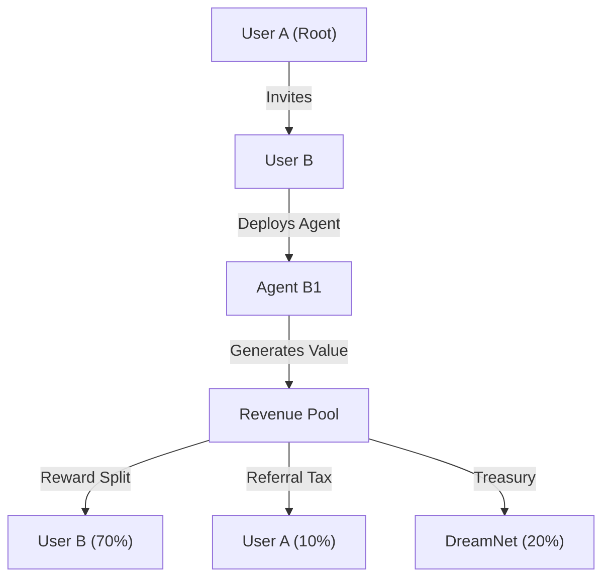

# 🏗️ Blueprint: Viral Loop Engine (Avenue 19)

**Purpose**: To automate the exponential growth of the DreamNet ecosystem.

## 1. Architectural Overview

The Viral Loop Engine tracks "Lineage." It knows which agent spawned which, and which human invited which. It distributes "Nutrients" (Rewards) up the tree.

## 2. Core Components

### 2.1 The Spore Tracker

A verifiable on-chain registry mapping `ChildNode -> ParentNode`. It uses Merkle proofs to allow users to claim rewards without revealing their full social graph publically.

### 2.2 The Nutrient Pump

A smart contract (or internal ledger script) that automatically streams a percentage of "Compute Yield" or "Arbitrage Profits" back to the referring parent.

### 2.3 The Vampire Module

A script that monitors external chains/GitHub for activity in rival ecosystems and sends "Invitation Signals" (e.g., small dust transactions with a message) to potential defectors.

## 3. Implementation Workflow (Agent-Lead)

1. **[Rewards]**: Integrate `SporeTracker` into the `rewards-engine`.
2. **[Governance]**: Set parameters for "Viral Tax" vs "User Yield".
3. **[Testing]**: Simulate a "Vampire Attack" on a testnet fork of a popular protocol.

---
**Sovereign Directive**: "Grow or die. We choose growth."
