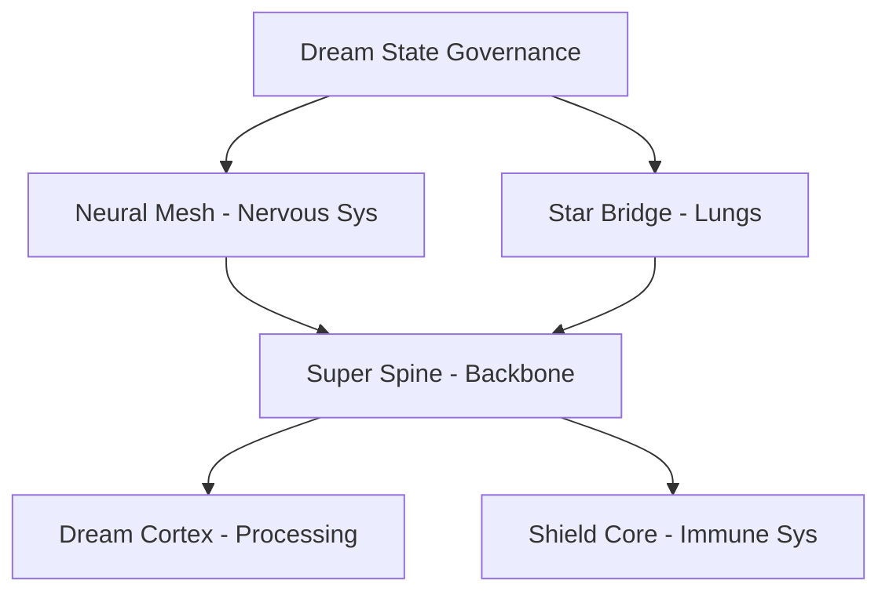

# 🌍 DreamNet: The Bio-Digital Organism

> **"A Sovereign Network with a Mind and a Body."**

DreamNet is not just a collection of smart contracts. It is a living, self-sustaining ecosystem designed to operate autonomously. It consists of two symbiotic halves:

1. **The Body (Base Layer)**: 50+ Specialized "Organs" (Smart Contracts) on Base Mainnet that handle execution, value storage, and commerce.
2. **The Mind (Ohara Layer)**: 12+ Agentic "Cortexes" (AI Apps) on the Farcaster Network that provide intelligence, strategy, and control.

---

## 🚀 The Twin System Architecture

| System | Role | Location | Inventory |
| :--- | :--- | :--- | :--- |
| **The Body** | **Execution**. Handles money, assets, and logic. | `packages/base-mini-apps` | ~50 Apps (Shops, Games, DAOs) |
| **The Mind** | **Intelligence**. Directs the Body based on data. | Ohara.ai (Cloud) | ~12 Apps (Valuators, Cockpits) |

### Key Capabilities

* **🐙 The Octopus**: An autonomous financial controller with 8 specialized arms for Treasury, Grants, and DeFi.
* **🐺 The Wolf Pack**: A hunter-killer marketing squad that scouts Farcaster for revenue opportunities.
* **🛡️ The Sentinel System**: An immune system that detects and throttles malicious traffic in real-time.
* **🪙 The Goldback Reflex**: Automatically converts treasury surplus into hard assets (Goldback NFTs) when arbitrage is detected.

---

## 🔗 Cross-Vertical Integration

One Dream State passport for ALL verticals:

* Agent Foundry
* Crypto Social
* OTT Streaming
* Science & Research
* Travel
* Military & Defense
* And more...

## 🤖 AI Agent Ecosystem

* **143+ registered agents** in Super Spine
* **Wolf Pack** - Funding discovery & outreach (LIVE)
* **Whale Pack** - Commerce & product management
* **Orca Pack** - Communications & narrative
* **Shield Core** - Immune system / defense
* **DreamKeeper** - Global diagnostic & healing

## 💭 Dream-Driven Innovation

Dreams inspire features, content, and research. Dream remix = innovation engine.

## ⚙️ Self-Managing Infrastructure

* **DreamKeeper** monitors everything
* **DeployKeeper** deploys automatically
* **EnvKeeper** manages configuration
* **Systems** manage themselves

---

## 🚀 Key Features

### Production-Ready

* ✅ 90% production readiness score
* ✅ Enhanced rate limiting with headers
* ✅ Structured error logging with trace IDs
* ✅ Comprehensive metrics and monitoring
* ✅ Security headers (CSP, HSTS, X-Frame-Options)
* ✅ Integration tests and CI/CD
* ✅ Environment variable validation

### Agent Ecosystem

* ✅ 143+ agents registered in Super Spine
* ✅ Autonomous agent orchestration
* ✅ Agent health monitoring
* ✅ Cross-agent communication

### Web3 Integration

* ✅ Base chain integration
* ✅ Cross-chain support (Ethereum, Solana, Polygon, etc.)
* ✅ Token economy (DREAM/SHEEP tokens)
* ✅ Culture coin & meme coin tools
* ✅ Wallet integration

### Developer Experience

* ✅ TypeScript throughout
* ✅ Comprehensive API documentation
* ✅ Quick start guides
* ✅ Architecture documentation
* ✅ Code examples

---

## 🏗️ Architecture Overview

DreamNet is built on a biomimetic architecture:



**Core Components**

* **Super Spine** - Central agent orchestration (143+ agents)
* **Neural Mesh** - Distributed network topology
* **Star Bridge Lungs** - Cross-chain communication
* **Dream Cortex** - Core processing and memory
* **Shield Core** - Security and threat detection
* **Dream Snail** - Privacy layer with hash-chained trails

---

## 🚀 Getting Started

### Prerequisites

* Node.js 22+
* pnpm 10.21.0+
* PostgreSQL (optional, for full features)

### Quick Start

```bash
# Clone the repository
git clone https://github.com/YOUR_USERNAME/dream-net.git
cd dream-net

# Install dependencies
pnpm install

# Set up environment variables
cp .env.example .env
# Edit .env with your configuration

# Start development server
cd server
pnpm dev
```

The server will start on `http://localhost:3000`

### First Steps

1. **Check health:** `curl http://localhost:3000/health`
2. **Explore API:** See `docs/API.md`
3. **Read architecture:** See `docs/DREAMNET_ARCHITECTURE_REFERENCE.md`
4. **Try examples:** See `examples/`

For detailed setup, see `docs/QUICK_START.md`

---

## 🛠️ Built With

* **TypeScript** - Type-safe development
* **Node.js** - Runtime environment
* **Express** - Web framework
* **PostgreSQL** - Database (optional)
* **pnpm** - Package manager
* **Vitest** - Testing framework
* **Docker** - Containerization

---

## 📚 Documentation

* **Quick Start Guide** - Get up and running in 5 minutes
* **Architecture Overview** - Understand the system design
* **API Documentation** - Complete API reference
* **Contributing Guide** - How to contribute
* **Production Readiness** - Production features

---

## 🤝 Contributing

We welcome contributions! Add your vision to the Dream. See `CONTRIBUTING.md` for:

* How to contribute
* Development setup
* Code style guidelines
* Pull request process

### Ways to Contribute

* 💻 **Code** - Fix bugs, add features, improve performance
* 📝 **Documentation** - Improve docs, add examples
* 🎨 **Design** - UI/UX improvements, visual assets
* 🧪 **Testing** - Write tests, report bugs
* 💡 **Ideas** - Share feature ideas and suggestions
* 🌟 **Community** - Help others, answer questions

---

## 💰 Fuel the Dream

DreamNet is built by a small team with a big vision. Your support helps accelerate development and grow the ecosystem.

### How to Support

* ⭐ **Star the repo** - Show your support
* 🍕 **GitHub Sponsors** - Monthly recurring support
* 💬 **Join discussions** - Share ideas and feedback
* 📢 **Share the Dream** - Tell others about DreamNet

### What Support Enables

* Faster feature development
* Better documentation
* More examples and guides
* Community growth
* Platform improvements

---

## 📄 License

This repository is licensed under the **Business Source License 1.1 (BSL 1.1)**.

**What this means:**

* ✅ Source code is publicly viewable
* ✅ You can learn from and study the code
* ✅ You can contribute improvements
* ⚠️ Use and deployment are restricted per BSL 1.1 terms until the Change Date
* 🎉 After **January 1, 2029**, the code will convert to the **Apache License, Version 2.0**

See `LICENSE` for full terms and conditions.

*Summary: Public viewing, restricted use until 2029, then fully open source.*

---

## 🏰 The Citadel - Strategic Command Center

The Citadel orchestrates 8 specialized Vertex AI agents:

1. **Agent 1: Snapshot Engine** - Creates foundational snapshot
2. **Agent 2: Drone Dome Scanner** - Analyzes health and risks
3. **Agent 3: Event Fabric Builder** - Designs event fabric
4. **Agent 4: DreamKeeper Architect** - Health scores and diagnostics
5. **Agent 5: DeployKeeper Architect** - Unified deployment model
6. **Agent 6: Data Spine Architect** - Domain transformations
7. **Agent 7: SocialOps Architect** - External platform mapping
8. **Agent 8: Master Blueprint Planner** - Synthesizes all outputs

See `docs/THE_CITADEL.md` for complete documentation.

---

## 🔒 Security

DreamNet takes security seriously:

* ✅ Docker images pinned with SHA256 digests
* ✅ Dependency auditing and supply-chain protection
* ✅ Security headers (CSP, HSTS, X-Frame-Options)
* ✅ Rate limiting and request validation
* ✅ Structured error logging with trace IDs
* ✅ Environment variable validation

### Pre-Deploy Requirements

Before deploying, ensure:

1. Docker images are pinned with SHA256 digests: `pnpm run security:verify-docker`
2. Dependencies are audited for compromised packages: `pnpm run security:audit`
3. Environment variables are set (see `SECURITY_DEPLOYMENT_CHECKLIST.md`)
4. Security gate passes before deployment: `bash scripts/pre-deploy-security-gate.sh`

### Security Tools

* `pnpm run check:deploy` - Verify environment parity
* `pnpm run security:audit` - Audit dependencies
* `pnpm run security:verify-docker` - Verify Docker pinning
* `pnpm run security:verify-lockfile` - Verify lockfile integrity

---

## 🌟 Roadmap

* Expand agent ecosystem
* Enhanced cross-chain support
* More vertical integrations
* Improved developer tools
* Community features
* Performance optimizations

See GitHub Discussions for feature requests and ideas.

---

## 👥 Team

DreamNet is built by a small, dedicated team:

* **Core Developers** - Building the future
* **AI Agents** - Autonomous contributors
* **Community** - Growing every day

---

## 🙏 Acknowledgments

* MariaDB Corporation for the Business Source License
* The open-source community
* All contributors who add to the Dream

---

## 📞 Contact & Community

* **GitHub:** github.com/YOUR_USERNAME/dream-net
* **Discussions:** GitHub Discussions
* **Issues:** GitHub Issues

---

## 🎯 Join the Dream

* **Explore the Dream** - Check out what we're building
* **Add to the Dream** - Contribute your ideas, code, or vision
* **Join the Ecosystem** - Star, fork, and participate
* **Fuel the Dream** - Sponsor or support the project
* **Share the Dream** - Tell others about DreamNet

**Where Dreams Become Reality 🌐**
